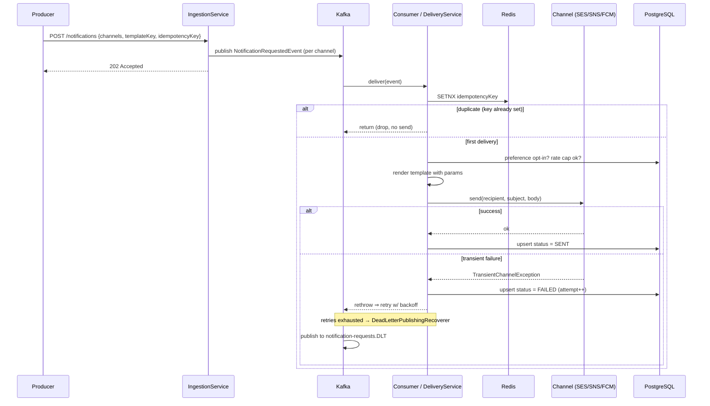
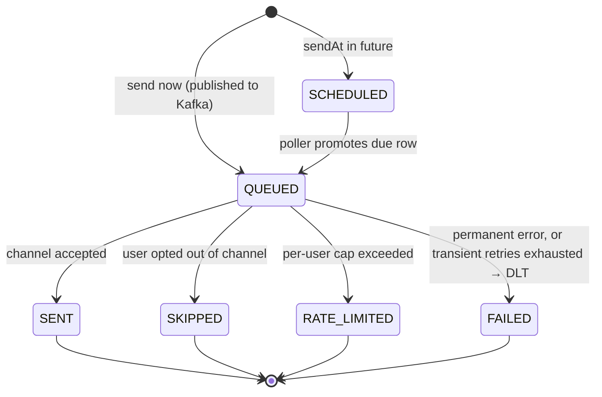
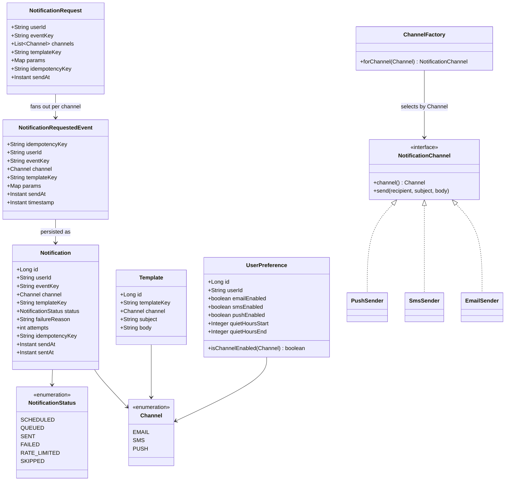

# Notification System — Diagrams

Mermaid diagrams (render natively on GitHub). Generated from the actual entities under
`src/main/java/com/umang/notification/model/entity/` and the service/consumer layer.

- [1. High-Level Design (HLD)](#1-high-level-design-hld)
- [2. Delivery Sequence](#2-delivery-sequence)
- [3. Notification State Machine](#3-notification-state-machine)
- [4. Domain Class Diagram](#4-domain-class-diagram)

---

## 1. High-Level Design (HLD)

Event-driven pub/sub: producers publish and return; the consumer renders, checks
preferences + rate limit, sends via the channel Strategy, and records status. Idempotency
and rate limiting live in Redis; the durable store is Postgres; poison records go to the DLT.

```mermaid
flowchart TB
    subgraph Producers
      Client[REST client / upstream service]
    end

    Client -->|POST /api/v1/notifications| API[NotificationController<br/>+ IngestionService]
    API -->|SETNX dedupe at edge| Redis[(Redis<br/>idempotency + rate limit)]
    API -->|publish 1 event per channel| Kafka{{Kafka<br/>notification-requests}}

    Sched[ScheduledNotificationPoller<br/>@Scheduled] -->|promote due SCHEDULED| Kafka
    API -->|future sendAt ⇒ SCHEDULED row| PG[(PostgreSQL<br/>Flyway-managed)]

    Kafka --> Consumer[NotificationConsumer]

    subgraph Delivery[NotificationDeliveryService pipeline]
      Consumer --> Idem[1. Idempotency SETNX]
      Idem --> Pref[2. Preference opt-out]
      Pref --> Rate[3. Rate limit]
      Rate --> Render[4. TemplateService render]
      Render --> Factory[5. ChannelFactory Strategy]
    end

    Idem -. duplicate .-> Drop[drop]
    Rate -. over cap .-> PG
    Pref -. opted out .-> PG

    Factory --> Email[EmailSender → SES]
    Factory --> Sms[SmsSender → SNS]
    Factory --> Push[PushSender → FCM]

    Email --> PG
    Sms --> PG
    Push --> PG

    Rate -->|counter/TTL| Redis
    Idem -->|SETNX| Redis

    Kafka -. retries exhausted .-> DLT{{notification-requests.DLT}}

    Delivery -.metrics.-> Prom[(Prometheus)]
```

---

## 2. Delivery Sequence

The asynchronous path of one notification, from publish to a durable `SENT` row — including
the retry → DLT branch on transient channel failure.



---

## 3. Notification State Machine

The `status` column on `notifications`. `QUEUED` and `SCHEDULED` are the two entry states;
everything else is terminal for that attempt.



---

## 4. Domain Class Diagram


