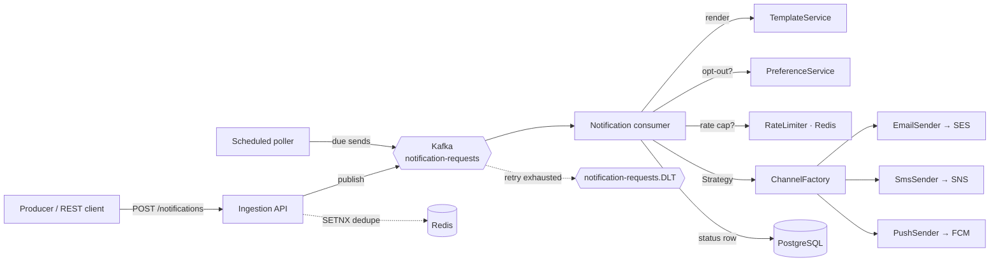

# Notification System

> A multi-channel, **event-driven notification platform** (Spring Boot 3.3.5 / Java 21) built
> around a **pub/sub backbone**: producers publish a request and return; delivery to email /
> SMS / push happens asynchronously through Kafka, with retry + DLQ, idempotency
> (effectively-once), per-user rate limiting, templating, preferences, and scheduling.

This is a classic system-design interview project. The interesting part isn't "send an email" —
it's the **platform concerns** around reliable, deduplicated, rate-limited fan-out at scale.

---

📐 **Diagrams:** HLD flowchart, delivery sequence, state machine, and domain class diagram
(Mermaid) → [DIAGRAMS.md](DIAGRAMS.md)

## What's inside

| Area | Highlights |
|---|---|
| **Pub/sub ingestion** | `POST /api/v1/notifications` validates + publishes a `NotificationRequestedEvent` to Kafka (`notification-requests`) and returns **202 Accepted**. Producers never block on delivery. |
| **Multi-channel senders** | **Strategy pattern** — `NotificationChannel` with `EmailSender` / `SmsSender` / `PushSender` (mock; real impls call SES / SNS / FCM). `ChannelFactory` selects by enum. |
| **Templating** | `Template` entity + a `{{placeholder}}` renderer; templates seeded via Flyway. |
| **Preferences** | `UserPreference` per-channel opt-in + quiet-hours; consumer skips opted-out channels. |
| **Retry + DLQ** | Kafka `DefaultErrorHandler` + `DeadLetterPublishingRecoverer`: retry with backoff, then route poison records to `notification-requests.DLT`. |
| **Idempotency** | Redis `SETNX` + a DB unique constraint on `idempotency_key` ⇒ **effectively-once**. |
| **Rate limiting** | Per-user Redis fixed-window counter; over-cap sends recorded as `RATE_LIMITED`. |
| **Scheduling** | `sendAt` future timestamp stored as `SCHEDULED`; a `@Scheduled` poller publishes due ones. |
| **Reads** | `GET /{id}` (status), `GET /user/{userId}` (keyset-paginated history). |
| **Ops** | Actuator health + Prometheus metrics; multi-stage non-root Dockerfile; healthcheck-gated compose (Postgres 17, Redis 7, KRaft Kafka). |
| **Quality** | Pure **Mockito** unit tests (no Docker) — run on JDK 21 via the byte-buddy surefire agent. |

---

## High-level design — the event-driven story



**Why decouple producers from delivery?** A checkout service should not wait on an SMS gateway
to finish a purchase. Publishing an event and returning **202 Accepted** means the producer's
latency is a Kafka append (single-digit ms), independent of how slow email/SMS providers are.
The broker also **absorbs bursts** (Black Friday order confirmations) and **survives consumer
downtime** — events wait on the log until workers catch up.

**Fan-out to channels.** One inbound request may target several channels. The ingestion service
fans it into **one event per channel**, so each channel retries, fails, and lands in the DLT
*independently* — a flaky SMS provider never blocks the email that already succeeded.

**Retry + DLQ.** The consumer just does the work and lets `TransientChannelException` propagate.
The container's `DefaultErrorHandler` retries a few times with a fixed backoff; once exhausted,
`DeadLetterPublishingRecoverer` copies the record to `notification-requests.DLT` for out-of-band
inspection or replay. Permanent errors (missing template) are recorded `FAILED` **without**
throwing, so they aren't pointlessly retried.

**Idempotency & effectively-once.** Kafka is **at-least-once** — a consumer can legitimately see
the same event twice (rebalance, or a crash after sending but before the offset commits). The
consumer claims each `idempotencyKey` with Redis `SETNX`; the first caller proceeds, duplicates
are dropped. **At-least-once broker + idempotent consumer = effectively-once** side effects (the
user sees the message once) without the cost of exactly-once transactions. The
`notifications.idempotency_key` unique constraint is the durable backstop if Redis is flushed.

**Rate limiting.** A per-user Redis counter with a TTL window caps how many notifications a user
can receive (protecting the user from flooding *and* downstream providers from our own retry
storms). Redis is the right home: the counter is shared across all app instances and `INCR` is
atomic. Over-cap sends are recorded `RATE_LIMITED`.

**Scheduling.** A request with a future `sendAt` is stored as `SCHEDULED` (params kept as JSON),
and a `@Scheduled` poller promotes due rows onto Kafka — from there the normal pipeline runs.
Simple, durable across restarts, and easy to cancel/reschedule. (Alternatives: Kafka delay
topics, Quartz, or SQS delay queues / EventBridge Scheduler in AWS.)

### How it scales

- **Partitioned consumers.** `notification-requests` has multiple partitions; each is consumed by
  exactly one instance in the `notification-service` group, so throughput grows by adding
  partitions + instances. Keying by `userId` preserves per-user ordering.
- **Per-channel worker pools.** Split into per-channel topics/consumer groups so a slow provider
  (SMS) can't back up fast ones (push), and each pool scales to its provider's throughput.
- **Stateless app** behind an autoscaler; Redis and Postgres scale independently. A blockbuster
  fan-out (send-to-all) becomes a batch job that produces to Kafka rather than an API call.

### AWS mapping

| This project | AWS |
|---|---|
| Kafka `notification-requests` | MSK, or **SQS/SNS** for simpler fan-out |
| `notification-requests.DLT` | SQS **dead-letter queue** |
| `EmailSender` | **SES** |
| `SmsSender` | **SNS** (SMS) |
| `PushSender` | **SNS** mobile push / **Pinpoint** (or FCM/APNs directly) |
| Rate limit / idempotency (Redis) | **ElastiCache** for Redis |
| Scheduled poller | **EventBridge Scheduler** / SQS delay queues |
| Postgres | **RDS** / Aurora |

---

## Tech stack

**Backend:** Java 21 · Spring Boot 3.3.5 · Spring Data JPA · Spring Kafka · Flyway
**Data:** PostgreSQL 17 · Redis 7 · Kafka (KRaft, no ZooKeeper)
**Ops:** Actuator · Micrometer/Prometheus · Docker (multi-stage) · Swagger UI

---

## Quick start

**Prerequisites:** JDK 21 (Temurin or Corretto) — build/tests need JDK 21 (Mockito breaks
on JDK 25) · Maven · Docker Desktop.

```bash
git clone https://github.com/guptaumang769/notification-system.git
cd notification-system

# 1. Start everything (compose starts postgres + redis + kafka + app), healthcheck-gated.
docker compose up --build

# Verify the app is up (published on :8096):
curl localhost:8096/actuator/health   # → {"status":"UP"}

# 2. Publish a notification (email + push) — returns 202 Accepted.
curl -X POST http://localhost:8096/api/v1/notifications \
  -H 'Content-Type: application/json' \
  -d '{
        "userId": "user-1",
        "eventKey": "order.shipped",
        "channels": ["EMAIL", "PUSH"],
        "templateKey": "order-shipped",
        "params": {"name": "Umang", "orderId": "A-1001", "trackingUrl": "https://track/A-1001"},
        "idempotencyKey": "order-A-1001-shipped"
      }'

# 3. Watch it deliver in the app logs (mock senders log "EMAIL sent to ...").
docker compose logs -f app | grep -Ei 'sent|delivered'

# 4. Read status / history.
curl http://localhost:8096/api/v1/notifications/1
curl 'http://localhost:8096/api/v1/notifications/user/user-1?size=20'
```

Send the **same `idempotencyKey`** twice and only one delivery happens (effectively-once). Fire
the request 6+ times in a minute and the extras come back `RATE_LIMITED`. Set
`CHANNEL_TRANSIENT_FAILURE_RATE=0.5` on the app to watch retries and the DLT fill up. Add a
future `"sendAt": "2030-01-01T00:00:00Z"` to see a row stored `SCHEDULED`.

- Swagger UI: `http://localhost:8096/swagger-ui.html`
- Health: `http://localhost:8096/actuator/health` · Metrics: `/actuator/prometheus`

### Run locally without Docker

```bash
# Start just the infra, then run the app from your IDE / mvn.
docker compose up -d postgres redis kafka
JAVA_HOME=$(/usr/libexec/java_home -v 21) mvn spring-boot:run
```

On Windows (PowerShell): `$env:JAVA_HOME="C:\Program Files\Eclipse Adoptium\jdk-21"; mvn spring-boot:run`.

---

## Testing

```bash
JAVA_HOME=$(/usr/libexec/java_home -v 21) mvn test    # macOS/Linux — pure unit tests, no Docker
```

On Windows (PowerShell), point `JAVA_HOME` at a JDK 21 first:

```powershell
$env:JAVA_HOME="C:\Program Files\Eclipse Adoptium\jdk-21"; mvn test
```

Pure **Mockito** unit tests cover template rendering (placeholder substitution), the channel
Strategy/Factory selection, idempotency (same key ⇒ exactly one send), preference opt-out
(channel skipped), the rate-limit trip, and the transient-failure → rethrow (DLT) path.

> **JDK 21 note.** Recent JDK 21.0.x builds broke Mockito's inline mock self-attach and needed a
> newer Lombok. The `pom.xml` pins **Lombok 1.18.38** + **byte-buddy 1.15.11**, uses the
> `maven-dependency-plugin` `properties` goal to resolve the byte-buddy agent jar, and attaches it
> via the surefire `argLine` (`-javaagent:${net.bytebuddy:byte-buddy-agent:jar} -Xshare:off`), so
> mocks work without dynamic self-attach.

---

## Author

**Umang Gupta** — backend engineer ·
[GitHub](https://github.com/guptaumang769)

_MIT License — free to use for learning._
